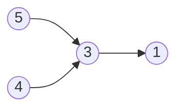
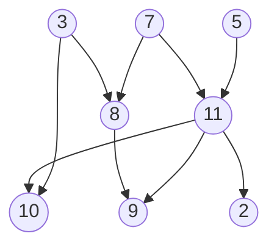
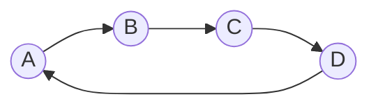

# procosort

A custom implementation of [topological sort](https://en.wikipedia.org/wiki/Topological_sorting). It outperfoms Kahn's algorithm and DFS with basic cases.

## Purpose

I'm making a compiler, and it needs to determine the order in which dependencies should be compiled. The compiler's architecture is based on that of [Gleam's](https://github.com/gleam-lang/gleam) _(amazing project btw)_, which is implemented in Rust and uses the `petgraph` crate for toposorting.

My compiler is written in Go, and I don't want to use a third-party module. A year before publishing this, around the time I started working on the compiler (2025), I had implemented an algorithm to sort forward type definitions and detect cycles. At the time, I didn't know what I had implemented was a topological sort algorithm. Still, I would like to rewrite my algorithm, mainly due to new knowledge I recently gained, and the change in purpose.

Like my algorithm from a year ago, everything was drafted on paper (at night) before I wrote a single line of code. I had about 2 or 3 different variations of the current ProCode algorithm implementation, so I wrote it in JavaScript and created a [test runner](https://github.com/ProCode-Software/topobench).

## Topological Sort

[Topological sort algorithms](https://en.wikipedia.org/wiki/Topological_sorting) sort vertices (which could represent packages or types) by the order in which they need to be defined. Those with no dependencies are defined first, with their dependents after. This happens recursively so that all dependencies are resolved before their dependents.

Consider the following graph:



It would have the following edges:

```
5 -> 3
4 -> 3
3 -> 1
```

For each edge `a -> b`, `b` depends on `a`. Think of it as: _`a`, then `b`_. This means `b` can never be processed before `a`.

By toposorting using `toposort([(5, 3), (4, 3), (3, 1)])`, you would get the following result:

```
[5, 4, 3, 1]
```

For each item in the returned array, its dependencies would have already been parsed. `5` is first because it has no dependencies.

### A more complex graph

Let's try a more complex graph:



> [!TIP]
> If you want to see the edges of each graph in an `a -> b` format, try viewing the [code of each Mermaid graph](./README.md#a-more-complex-graph) in the README.

The result:

```
5, 7, 3, 11, 8, 2, 10, 9
```

### Cycles

The graphs I explained above don't contain cycles, or vertices defined in terms of themselves. Graphs without cycles are called [directed acyclic graphs (DAGs)](https://en.wikipedia.org/wiki/Directed_acyclic_graph).

The graph below contains a cycle:



As we read the graph:

1. `A` depends on `B`
2. `B` depends on `C`
3. `C` depends on `D`
4. `D` depends on `A` itself

When there are cycles, the order cannot be determined. For example, if the graph represents type declarations and their dependencies, at least one type indirectly depends on itself.

## Explanation of the ProCode Algorithm

The ProCode algorithm implements a topological sort. In simple terms, the process is:


1. For each vertex, determine the direct dependencies. Visually, this can be done by counting the incoming arrows. So for the first example, which is also shown right above:
   | Vertex | Dependencies |
   | ------ | ------------ |
   | 1 | 3 |
   | 3 | 5, 4 |
   | 4 | _None_ |
   | 5 | _None_ |
    > Note: Vertex `2` doesn't exist
2. Now that we have the direct dependencies, append the dependencies of each dependency. Make sure not to remove the existing ones.
   | Vertex | Dependencies |
   | ------ | :-------: |
   | 1 | 3 **_+ 5, 4_** |
   | 3 | 5, 4 |
   | 4 | _None_ |
   | 5 | _None_ |

    Since vertices `4` and `5` don't have any dependencies, they will still be empty, and the dependencies of vertex `3` will remain the same. The only thing that changed was we added the dependencies of `3` (`5` and `4`) under vertex `1`.

3. Count the number of dependencies for each vertex.
   | Vertex | # of Deps |
   | ------ | :-------: |
   | 1 | 3 |
   | 3 | 2 |
   | 4 | 0 |
   | 5 | 0 |
4. We use that information to determine the final sorting. The vertices with the least dependencies (there should be at least one with 0) go first. **The final result is `[4, 5, 3, 1]`.**
    > You could swap `4` and `5`, which have the same number of dependencies. As a result, toposort can result in nondeterministic results that are still correct.

### The complex example


1. Make a map of each vertex's dependencies
   | Vertex | Dependencies |
   | ------ | ------------ |
   | 5 | _None_ |
   | 7 | _None_ |
   | 3 | _None_ |
   | 8 | 3, 7 |
   | 11 | 7, 5 |
   | 2 | 11 |
   | 9 | 8, 11 |
   | 10 | 11, 3 |
2. Append indirect dependencies
   | Vertex | Dependencies |
   | ------ | ------------ |
   | 5 | _None_ |
   | 7 | _None_ |
   | 3 | _None_ |
   | 8 | 3, 7 |
   | 11 | 7, 5 |
   | 2 | 11 **_+ 7, 5_** |
   | 9 | 8 **_+ 3, 7_**, 11 **_+ 7, 5_** |
   | 10 | 11 **_+ 7, 5_**, 3 |
    > [!NOTE]
    > The dependency `7` is duplicated for vertex `9`. I didn't get incorrect results when this happened, so I don't think it matters.
3. Sort by number of dependencies. A possible order would be: `5, 7, 3, 8, 11, 2, 10, 9`. Again, `5`/`7`/`3` could be swapped, as well as `8`/`11`.

### Cycles


My implementation detects cycles during step 2. If one of the dependencies of a vertex is the vertex itself, then there is a cycle.

| Vertex | Dependencies                 |
| ------ | ---------------------------- |
| A      | D **_+ C_**                  |
| B      | A **_+ D, C_**               |
| C      | B **_+ A, D, \(C\)_**        |
| D      | C _(rest are not processed)_ |

We can see that `C` depends on `C`, so there is a cycle.
Note that the order may not be the exact same as this, so it could _possibly_ be a different vertex other than `C`, depending on the order of iteration. The ProCode algorithm stops and returns immediately after finding a cycle, so the indirect dependencies of `D` (for this example) won't be resolved.

### Deviations

Nondeterministic results can be caused by the order in which the vertices are iterated over in step 2. Implementations may use unordered programming structures, such as `Set` in JavaScript or `map` in Go. As a result, the iteration order for steps 1 and 2 may be different. This can cause different orders between vertices with the same number of dependencies, and nondeterministic cycle detection. I have not seen incorrect behavior with these deviations.

### Performance

ProCode's algorithm consistently performed faster than Kahn's algorithm and a depth-first search (DFS) algorithm.

The benchmarks below were run by [topobench](https://github.com/ProCode-Software/topobench) in Bun

| Implementation      | Score | Time          |
| ------------------- | ----- | ------------- |
| ProCode's Algorithm | 12    | 0.40136000 ms |
| Kahn's Algorithm    | 12    | 2.0042590 ms  |
| Depth-First Search  | 12    | 1.3345300 ms  |

System info:

- CPU: Intel(R) Core(TM) i5-1035G1 CPU @ 1.00GHz
- RAM: 16GB
- OS: Linux 7.0.0-22-generic x86_64 (Ubuntu 26.04 LTS)
- Runtime: Bun 1.3.14+0d9b296af
- Date: 9 June 2026

### Variations Considered

These are variations I thought about, but didn't implement because I didn't find errors in my current algorithm.

- Deduping each vertex's dependencies. As mentioned above, I didn't see incorrect behaviour with duplicates.
- A third pass for finding dependencies. I though of this because when iterating over the vertices, its dependencies could reference another vertex that we haven't iterated over yet.

## License

MIT License
